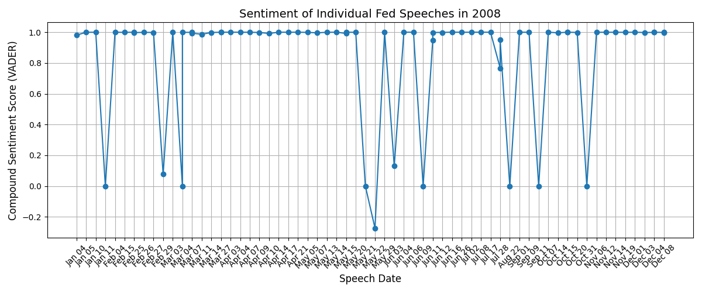
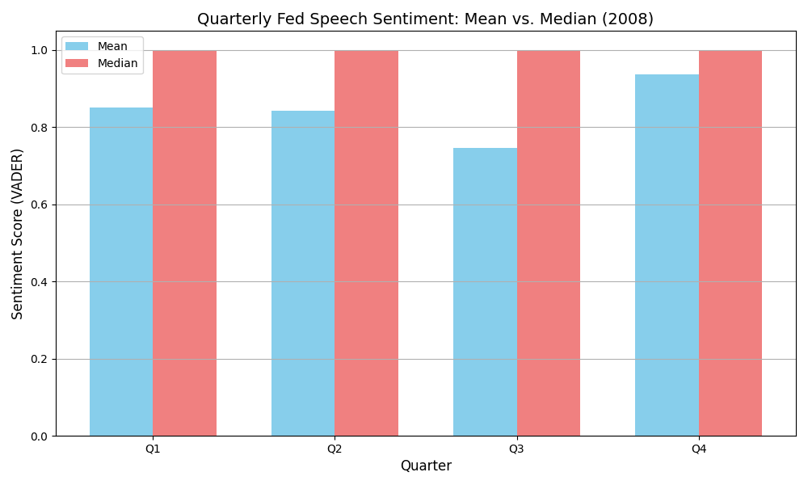
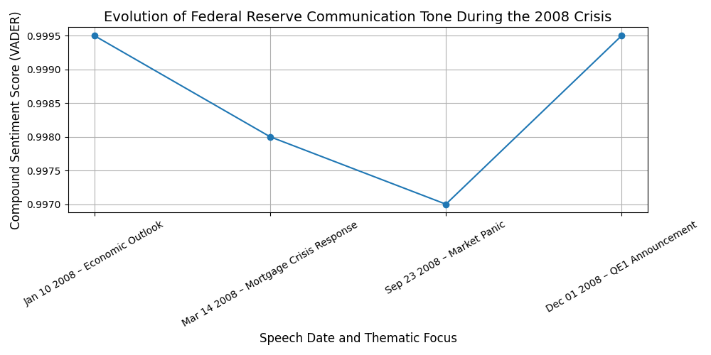

# The Signaling Channel of QE during the Global Financial Crisis: Evidence from Fed Communication Tone

This repository is part of the seminar **“New Regimes of Monetary Policy”** at **DIW Berlin (German Institute for Economic Research)**. It accompanies the theoretical and analytical study of the **2008 Global Financial Crisis**, with a particular focus on **Quantitative Easing (QE)** and the **signaling channel** of central bank communication.

The project investigates the **evolution of tone in Federal Reserve speeches during 2008**, using natural language processing (NLP) tools. It aims to detect whether shifts in sentiment reflect monetary policy stances and crisis severity during the early stages of QE.

This analytical prototype is not only relevant for speech analysis of the Fed but can be extended to:

- Other Fed communication channels (e.g., testimonies, FOMC press conferences),
- International central banks (e.g., **European Central Bank**),
- Broader macro-financial event detection pipelines.


## 🧠 What Does This Repo Do?

- Scrapes all 2008 Fed speeches from the [official website](https://www.federalreserve.gov/newsevents/speech/2008speech.htm)
- Applies sentiment analysis using the **VADER** lexicon ([GitHub Repo](https://github.com/cjhutto/vaderSentiment))
- Aggregates and visualizes tone dynamics across **time**, **individual policymakers**, and **quarters**
- Supports interpretation of **communication shifts** during key policy moments, e.g., Lehman Brothers collapse or first QE programs

The approach uses **NLP** methods to quantify tone and leverages Python for reproducibility and extension.


## 📈 Results

This section presents the three key visualizations generated from the tone analysis of 2008 Fed speeches. The sentiment scores were computed using **VADER**, an NLP tool designed for capturing tone in social and economic contexts.


<p align="center">
  
  <br><em><strong>Figure 1:</strong> Sentiment scores (compound VADER polarity) of individual Federal Reserve speeches in 2008. While the majority of speeches express highly positive tone (close to +1), several speeches around key market panic episodes – especially in March, June, and September – exhibit sharp drops to neutral or negative territory. This graph captures the volatility and urgency in tone during the most critical phases of the financial crisis.</em>
</p>


<p align="center">
  
  <br><em><strong>Figure 2:</strong> Quarterly average (blue) and median (red) sentiment scores of all Fed speeches in 2008. The data show a notable decline in average tone from Q1 to Q3, with a recovery in Q4, aligning with the timeline of quantitative easing (QE1) announcements. Interestingly, the median sentiment remains consistently high across all quarters, indicating that only a subset of speeches drove the average sentiment drop—likely those given by central figures at pivotal crisis moments.</em>
</p>


<p align="center">
  
  <br><em><strong>Figure 3:</strong> Evolution of tone for four landmark Fed speeches in 2008, each tied to a distinct policy or market event. Tone drops significantly between January and September, reflecting worsening market conditions and escalating interventions. The final speech (QE1 announcement in December) marks a sharp rebound in sentiment score, suggesting deliberate use of tone to support credibility and calm markets during extraordinary easing.</em>
</p>


## 💡 Summary

This prototype provides empirical evidence on how **central bank tone** evolved during the pivotal year of 2008. It uses a **transparent NLP pipeline** to trace tone dynamics at high resolution – by day, by speaker, and by quarter.

Its modular structure allows for future extensions:
- Comparing **Fed speeches vs. testimonies**
- Cross-institutional tone studies (e.g., ECB, BoE)
- Enhancing with **topic modeling** or **machine learning classifiers** beyond lexicon methods

The work contributes to ongoing research on central bank transparency, credibility, and the signaling power of monetary policy communication.


## 🔁 Reproducibility

To run the full pipeline and regenerate plots:

1. Clone the repository  
2. Create a virtual environment:  
   ```bash
   python3 -m venv venv && source venv/bin/activate
3. Install dependencies by running `pip install -r requirements.txt` in the terminal
4. Run `make all` in the terminal


# 📚 Suggested Readings & References
- VADER Sentiment Analysis Repo: https://github.com/cjhutto/vaderSentiment
- Federal Reserve 2008 Speeches: https://www.federalreserve.gov/newsevents/speech/2008speech.htm
- Fratzscher, M., & Rieth, M. (2019). Monetary Policy, Innovation and Productivity: Evidence from the Euro Area. DIW Discussion Paper.
- Hansen, S., McMahon, M., & Prat, A. (2018). Transparency and Deliberation within the FOMC: A Computational Linguistics Approach. Quarterly Journal of Economics.
- Schmeling, M., & Wagner, C. (2019). Does Central Bank Tone Move Asset Prices? International Journal of Central Banking.

# Licensing
The repository is licensed under the MIT license.
Contributions and extensions are welcome — especially from researchers at DIW Berlin, ECB, or other macro-finance research communities. :raised_hands: